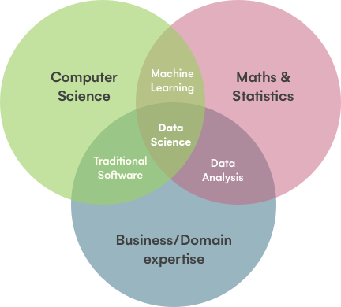

# Sumário

<ul>
    <li>
        <a href="#introducao">1. Prefácio</a>
    </li>
    <li>
        <a href="#introducao">2. Introdução</a>
        <ul>
            <li>
                <a href="#data_science">2.1 O que é Data Science?</a>
            </li>
            <li>
                <a href="#disciplines">2.2 Disciplinas do Data Science</a>
                <ul>
                    <li>
                        <a href="#discipline_1">2.2.1 Perspectiva da Matemática e Estatistica</a>
                    </li>
                    <li>
                        <a href="#discipline_2">2.2.2 Perspectiva de Negócios</a>
                    </li>
                    <li>
                        <a href="#discipline_3">2.2.3 Perspectiva Computacional</a>
                    </li>
                    <li>
                        <a href="#discipline_4">2.2.4 Ciencia de Dados</a>
                    </li>
                </ul>
            </li>
        </ul>
    </li>
</ul>

<h1 id="introducao">1. Prefácio</h1>

Bem vindo as anotações e aprendizados que tive conhecendo Data Science! Nesse repositório terá desde conhecimento teórico até conhecimento prático de como e do que se trata Data Science. Seguindo de maneira inicial até a forma mais avançada para você que está aprendendo ou que esteja querendo rever algum conceito esquecido.

Espero que gostem!

<h1 id="introducao">2. Introdução</h1>

<h2 id="data_science">2.1 O que é Data Science?</h2>

O Data Science é uma área multidisciplinar bastante requisitada na atualidade que mescla habilidades de matemática e estatistica, ciência da computação e dominio de negócios para ser aplicada. Sua principal atividade é na extração, filtragem, manipulação e analise dos dados, gerando conhecimentos e insights desses dados a serem utilizados para uma tomada de decisão.

Pode ser aplicada em diversos segmentos, pois dados é o que não falta na atualidade. E por conta disso, a demanda por profissionais na área é alta, pois a capacidade de gerar dados é muito maior do que a capacidade humana de entendimento dos dados, sendo uma porta aberta para diversas oportunidades. 

<h2 id="disciplines">2.2 Disciplinas do Data Science</h2>

</img>

<h3 id="discipline_1">2.2.1 Perspectiva da Matemática e Estatistica</h3>

Grande maioria dos modelos e tecnicas utilizadas em data science vem a partir de estudos da matemática e estatistica. A principio, o campo da estatistica almeja fazer com que os dados façam sentido, achar correlações de diferentes variaveis antes inimaginaveis, tentar explicar comportamentos através dos dados, as vezes para prever situações, etc.

Porém, há uma limitação de que sem computadores, quanto mais variaveis aparecem, mais dificil se torna de poder analisar, calcular e entender os dados dispostos. As bases de dados modernas são muito complexas a ponto de a estátisca sozinha não conseguir satisfazer sem a ajuda de outros componentes principais, como, por exemplo, a computação. 

Além disso, vale destacar a sua estreita relação com a perspectiva de negócio. Achar correlação entre variaveis pode ser uma tarefa simples, porém, estudar as variaveis e buscar o contexto por trás da sua descoberta é o grande ponto da análise de dados e talvez o mais desafiador. Um exemplo, de como é facil achar uma certa correlação entre variaveis pode ser encontrada quando pesquisamos por <a href="https://www.tylervigen.com/spurious-correlations">"Spurious Correlations"</a>, encontrando diversas correlações que não fazem o menor sentido, que não agregam em nada. (Devo confessar que há algumas bem engraçadas!)

<h3 id="discipline_2">2.2.2 Perspectiva de Negócios</h3>

Com tanta informação dentro de um negócio, de uma empresa, sobre algum produto, como utiliza-la da melhor forma para que tomemos a melhor a decisão a ser seguida. É um desafio e tanto a ser tomado somente olhando os dados e não saber o que exatamente fazer com eles. 

Ou, você até estuda os dados, mas como obter um contexto de negócio que possa agregar valor ao produto, que gere valor ao usuário. Como gerar uma história através dos dados que apresente o que aconteceu, a justificativa e o resultado através dos dados (Storytelling com Dados). 

E com o advento da tecnologia, em um mundo tão moderno, dados estão por toda a parte. Há milhares de produtos novos que podem ser lançados se olharmos para os dados carinhosamente. Aplicativos de redes sociais com grande quantidade de informações, mercado financeiro e suas inumeras variaveis e dados históricos, a interação do usuário com o aplicativo afim de estudar a experiencia do usuário, etc.

Esse são alguns desafios sobre a perspectiva de negócios afim de tornar o produto melhor.

<h3 id="discipline_3">2.2.3 Perspectiva Computacional</h3> 

Nos últimos anos vimos um grande salto da tecnologia da informação em diversos segmentos. Afinal, antes não existia Netflix, Spotify, Disney+, AirBnB, Facebook, Twitter, etc, e todas revolucionaram o mundo. Hoje não consigo imaginar o mundo sem algumas dessas ferramentas. E com o uso exacerbado de todas elas, imagina a quantidade de dados que as empresas geram a cada segundo.

</img>

Com tanta massa de dados, há desafios tecnicos como ferramentas, frameworks e tecnologia a ser utilizada para que possamos atender a essa vasta quantidade de dados. Entretanto, os dados estão ai, há quem diga que dados é o novo petróleo. Com a escolha certa e com bom conhecimento um mundo de novas portas é aberta.

<h3 id="discipline_4">2.2.4 Ciencia de Dados</h3>

A Ciencia de Dados vem como uma área para lidar com todas as perspectivas listadas, capturar, filtrar, manipular, analisar, exibir esses dados e trabalhar para que funcione em produção caso seja algo além de um estudo. Claro que, alguns dos pontos não precisa ter dominio completo, afinal, muito da parte de negócio pode ser adquirida com o tempo, na experiencia, troca de informação com pessoas inclusas na parte de negócios, sendo o mais certo, pois não vá tirar conclusões precipitadas sem saber sobre o dominio de negócios.

Sendo assim, convido-o a ler todo o conteudo desse projeto para aprender mais sobre a profissão ou para relembrar algum conteudo. Vamos lá!?
